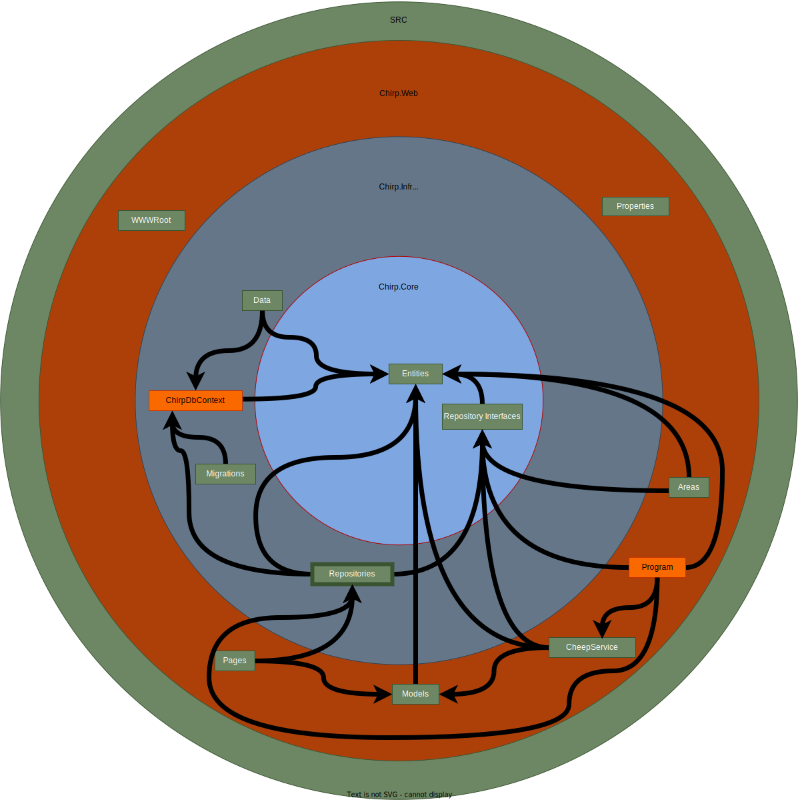
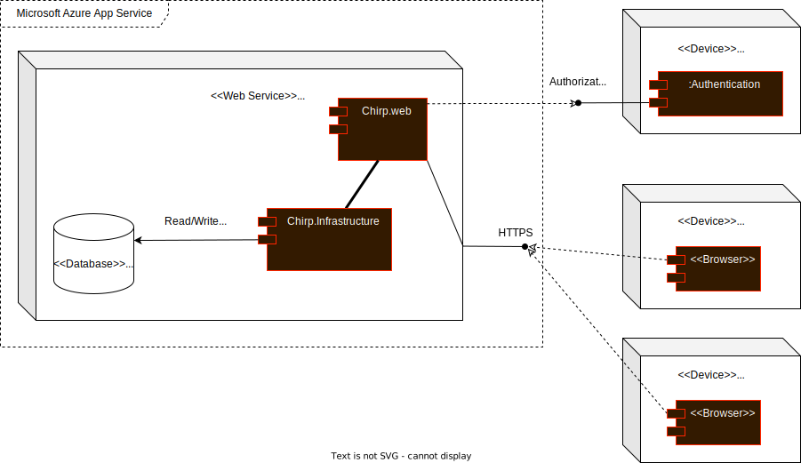
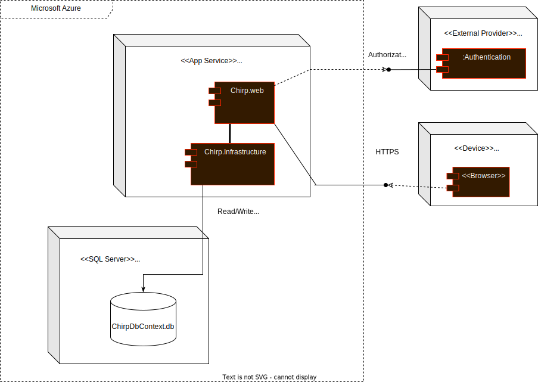
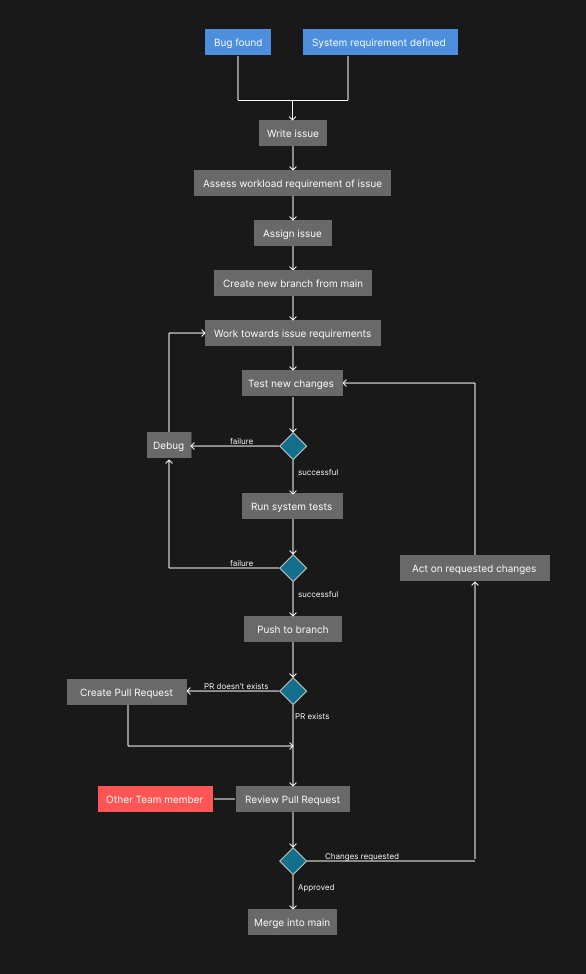
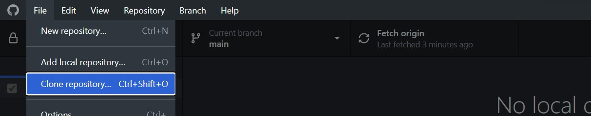
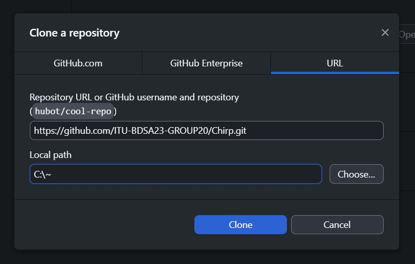

# Design and Architecture of _Chirp!_

## Domain model


> The above image is a UML class diagram depicting the domain model of ***Chirp!***.

## Architecture — In the small



> The above image illustrates the architecture of ***Chirp!***. It's onion based and each onion layer represents a package in the "src" folder of the application.

## Architecture of deployed application


>As we ran out of credits on Azure, we had to switch back to using an in-memory Sqlite database.
> Which is the setup the deployment diagram above illustrates. The first commit hash after reverting back to in-memory Sqlite database is: eb9b72d3ee52408b700a1912c9be30edc007488e.


> This deployment diagram illustrates our former setup, where we used an Azure hosted SQL server.
> The hash of the latest commit using Azure SQL server is: e79d7c8bece998633b05939e62f4fe29495a410a.

## User activities

> Illustrate typical scenarios of a user journey through your *Chirp!* application. That is, start illustrating the first page that is presented to a non-authorized user, illustrate what a non-authorized user can do with your *Chirp!* application, and finally illustrate what a user can do after authentication.
>
> Make sure that the illustrations are in line with the actual behavior of your application.

## Sequence of functionality/calls trough _Chirp!_


>Sequence call diagram for an un-authenticated user requesting the root endpoint of the application.

# Process

## Build, test, release, and deployment


> Illustrate with a UML activity diagram how your *Chirp!* applications are build, tested, released, and deployed. That is, illustrate the flow of activities in your respective GitHub Actions workflows.
>
> Describe the illustration briefly, i.e., how your application is built, tested, released, and deployed.

## Team work

> Show a screenshot of your project board right before hand-in. Briefly describe which tasks are still unresolved, i.e., which features are missing from your applications or which functionality is incomplete.
>
> Briefly describe and illustrate the flow of activities that happen from the new creation of an issue (task description), over development, etc. until a feature is finally merged into the `main` branch of your repository.



The process of implementing changes to the system starts by defining the wanted changes or the problem at hand and writing an issue describing it. The required workload is assessed for the issue. The issue is then assigned to an appropriate amount of team members. The team member(s) then creates a new branch from main and starts working towards the issue acceptance criteria. The new changes are then tested to see if it works as expected. Once it works, run the system tests to ensure no other functionality has been broken in the process. If any test fails, debugging commences and the test phase repeats. If everything works, the changes are pushed to the branch and a pull request is made. Another team member reviews said pull request. If any changes are requested, those will be acted upon and the test phase repeats. When a pull request is approved, the branch will be merged into main.


## How to make _Chirp!_ work locally

> There has to be some documentation on how to come from cloning your project to a running system. That is, Rasmus or Helge have to know precisely what to do in which order. Likely, it is best to describe how we clone your project, which commands we have to execute, and what we are supposed to see then.


### 1. cloning the project
One way of cloning the project is through the Github Desktop application.

- In the Github Desktop application navigate to the '*file*' tab in the top left corner and press 'Clone repository.

\

- Navigate to the 'URL' tab. 
- Input the following URL in the 'URL' input field and press the clone button.

        https://github.com/ITU-BDSA23-GROUP20/Chirp.git

- Input the appropriate filepath for where you want to store the files in 'Local path' input field. 
  



## How to run test suite locally
>To locally run the test suite, simply enter the following commands while being in the root directory of the project:
>```bash
>dotnet test test/Chirp.CoreTests; 
>dotnet test test/Chirp.InfrastructureTests; 
>dotnet test test/Chirp.WebTests
>```

> Briefly describe what kinds of tests you have in your test suites and what they are testing.

The test suite can be located in the `Chirp/Test` folder. Here you will find 4 folders, `Chirp.CoreTests`, `Chirp.InfrastructureTests`, `Chirp.WebTests` and `Test_Utilities`. 
The `Test_Utilities` folder contains helper classes and methods used in the test suites. The other folders contain the test suites for the respective packages.

### Contents of test suites

#### Chirp.CoreTests
* Testing that records and classes in fact contain the types and attributes defined in the class and record definitions.
* Testing of constraints on class and record members.
* Testing of correct instantiation of objects as defined in the `Chirp.Core` package.

#### Chirp.InfrastructureTests
* Testing that repositories(Base-,Cheep-, Author-, Follow- and Reaction-) retrieve, delete, update and add data correctly.
#### Chirp.WebTests
* Testing that the application functions as expected across packages. 

> The tests located in Chirp.CoreTests and Chirp.InfrastructureTests are all Unit tests.


# Ethics

## License

> This application uses the GPL-2 software license.

## LLMs, ChatGPT, CoPilot, and others

> State which LLM(s) were used during development of your project. In case you were not using any, just state so. In case you were using an LLM to support your development, briefly describe when and how it was applied. Reflect in writing to which degree the responses of the LLM were helpful. Discuss briefly if application of LLMs sped up your development or if the contrary was the case.

In our project, we have attempted to strategically leverage LLMs to enhance efficiency where reasonable. The LLMs used in the project are \*Chat-GPT\* and \*Github Co-Pilot\*. They served primarily as sparring partners during debugging processes, where they occasionally have proven helpful in interpreting cryptic error messages or identifying the cause of an unexpected result.

In our experience, the replies received from the LLMs have often been inadequate or inaccurate, which is likely due to the LLMs incomplete scope of the project. Despite this, the LLMs have helped the development of the project although it has not been substantially.
