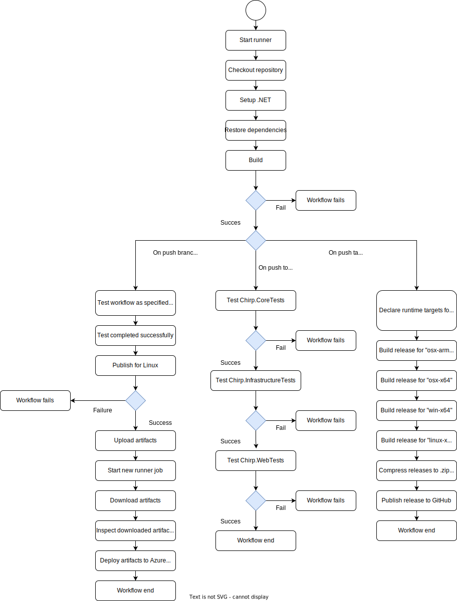
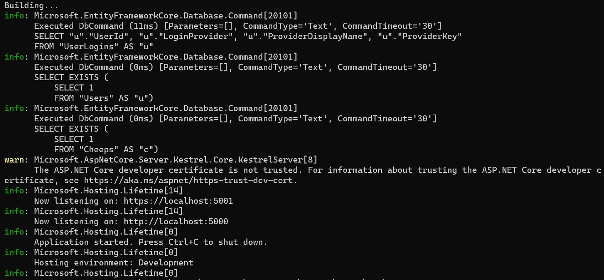
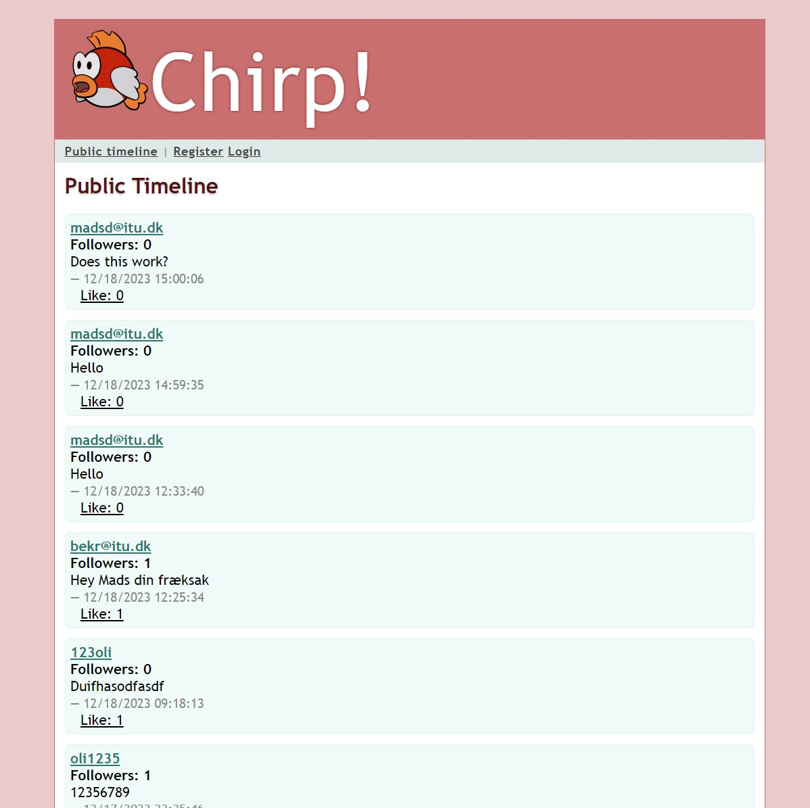

# Design and Architecture of _Chirp!_

## Domain model


> The above image is a UML class diagram depicting the domain model of ***Chirp!***.

## Architecture — In the small


> The above image illustrates the architecture of ***Chirp!***. It's onion based and each onion layer represents a package in the "src" folder of the application.

## Architecture of deployed application


> As we ran out of credits on Azure, we had to switch back to using an in-memory Sqlite database.
> Which is the setup the deployment diagram above illustrates. The first commit hash after reverting back to in-memory Sqlite database is: eb9b72d3ee52408b700a1912c9be30edc007488e.


> This deployment diagram illustrates our former setup, where we used an Azure hosted SQL server.
> The hash of the latest commit using Azure SQL server is: e79d7c8bece998633b05939e62f4fe29495a410a.

## User activities

> Illustrate typical scenarios of a user journey through your *Chirp!* application. That is, start illustrating the first page that is presented to a non-authorized user, illustrate what a non-authorized user can do with your *Chirp!* application, and finally illustrate what a user can do after authentication.
>
> Make sure that the illustrations are in line with the actual behavior of your application.


## Sequence of functionality/calls trough _Chirp!_


> Sequence call diagram for an un-authenticated user requesting the root endpoint of the application.

# Process

## Build, test, release, and deployment



> Describe the illustration briefly, i.e., how your application is built, tested, released, and deployed.

### Build, and Test

On pull, and push-requests, the program is built, and tested using the provided test-suite.

### Deployment of the application

On push to the "main" branch, the program is built and tested. If building and testing of the program succeeds, the program is compiled for Linux and uploaded as an artifact to the deployment job.

The deployment job downloads the artifacts, and deploys them to the Azure Web Service.

### Release of the application

On pushes with the tag "v*.*.*", the program is Built. After building of the program succeeds, runtime targets for "osx-arm64", "osx-x64", "win-x64", "linux-x64" are defined, and the program is subsequently compiled for these platforms.
After compiling for the platforms, the outputted folders are compressed to .zip or .tar formats, depending on what is appropriate for the targeted platform.
The compressed folders are now released on GitHub.

## Team work


> Show a screenshot of your project board right before hand-in. Briefly describe which tasks are still unresolved, i.e., which features are missing from your applications or which functionality is incomplete.


The process of implementing changes to the system starts by defining the wanted changes or the problem at hand and writing an issue describing it. The required workload is assessed for the issue. The issue is then assigned to an appropriate amount of team members. The team member(s) then creates a new branch from main and starts working towards the issue acceptance criteria. The new changes are then tested to see if it works as expected. Once it works, run the system tests to ensure no other functionality has been broken in the process. If any test fails, debugging commences and the test phase repeats. If everything works, the changes are pushed to the branch and a pull request is made. Another team member reviews said pull request. If any changes are requested, those will be acted upon and the test phase repeats. When a pull request is approved, the branch will be merged into main.

### Discrepancies in commit amounts of group members

When observing the amount of commits made by each group member, some anomalies can be seen. If a team member has a noticeably larger amounts of commits than others, it should be taken into account, that some or many of these extra commits are in regards to the deployment and release workflow files, that where the cause of a lot of commits relating to debugging these workflows.

## How to make _Chirp!_ work locally

> There has to be some documentation on how to come from cloning your project to a running system. That is, Rasmus or Helge have to know precisely what to do in which order. Likely, it is best to describe how we clone your project, which commands we have to execute, and what we are supposed to see then.

### 1. cloning the project

One way of cloning the project is through the Github Desktop application.

- In the Github Desktop application navigate to the '*file*' tab in the top left corner and press 'Clone repository'.

\

- Navigate to the 'URL' tab.
- Input the following URL in the 'URL' input field.

  https://github.com/ITU-BDSA23-GROUP20/Chirp.git

  - Input the appropriate filepath for where you want to store the files in 'Local path' input field.
    
- Press the clone button.

Alternatively, the project can be cloned through the terminal with the following command:

git clone https://github.com/ITU-BDSA23-GROUP20/Chirp.git
### 2. Setting up user secrets

Once you have the project cloned, make sure that you have your GitHub OAuth secrets ready.
Once that is done, open a new terminal and navigate to the path `Chirp/src/Chirp.Web`, then run these commands:

dotnet user-secrets init
Then

dotnet user-secrets set "authenticationGithubClientId" "<YOUR_CLIENT_ID>"
Where `<YOUR_CLIENT_ID>` is your generated client ID.
Then

dotnet user-secrets set "authenticationGithubClientSecret" "<YOUR_CLIENT_SECRET>"
Where `<YOUR_CLIENT_SECRET>` is your generated client secret.

### 3. Running the system

- Open a new terminal and navigate to `Chirp/src/Chirp.Web` in said terminal.
- Type the following command to run the system locally.

  dotnet run --launch-profile https

> Note: The launch profile argument is only necessary if you intend to use github authentication.

The terminal should output the following lines:



- Open your browser of choice and open a page with the following URL.

  localhost:5001

  - You should be greeted by the following page.
    

You are now running the system locally.

## How to run test suite locally

To locally run the test suite, simply enter the following commands while being in the root directory of the project:

```bash
dotnet test test/Chirp.CoreTests; 
dotnet test test/Chirp.InfrastructureTests; 
dotnet test test/Chirp.WebTests
```
The test suite can be located in the `Chirp/Test` folder. Here you will find 4 folders, `Chirp.CoreTests`, `Chirp.InfrastructureTests`, `Chirp.WebTests` and `Test_Utilities`.
The `Test_Utilities` folder contains helper classes and methods used in the test suites. The other folders contain the test suites for the respective packages.

### Contents of test suites

#### Chirp.CoreTests

* Testing that records and classes in fact contain the types and attributes defined in the class and record definitions.
* Testing of constraints on class and record members.
* Testing of correct instantiation of objects as defined in the `Chirp.Core` package.

#### Chirp.InfrastructureTests

* Testing that repositories(Base-,Cheep-, Author-, Follow- and Reaction-repository) retrieve, delete, update and add data correctly.

#### Chirp.WebTests

* Testing that the application functions as expected across packages.

The tests located in Chirp.CoreTests and Chirp.InfrastructureTests are all Unit tests.

# Ethics

## License

This application uses the GPL-2 software license.

## LLMs, ChatGPT, CoPilot, and others

> State which LLM(s) were used during development of your project. In case you were not using any, just state so. In case you were using an LLM to support your development, briefly describe when and how it was applied. Reflect in writing to which degree the responses of the LLM were helpful. Discuss briefly if application of LLMs sped up your development or if the contrary was the case.

In our project, we have attempted to strategically leverage LLMs to enhance efficiency where reasonable. The LLMs used in the project are \*Chat-GPT\* and \*Github Co-Pilot\*. They served primarily as sparring partners during debugging processes, where they occasionally have proven helpful in interpreting cryptic error messages or identifying the cause of an unexpected result.

In our experience, the replies received from the LLMs have often been inadequate or inaccurate, which is likely due to the LLMs incomplete scope of the project. Despite this, the LLMs have helped the development of the project although it has not been substantially.
