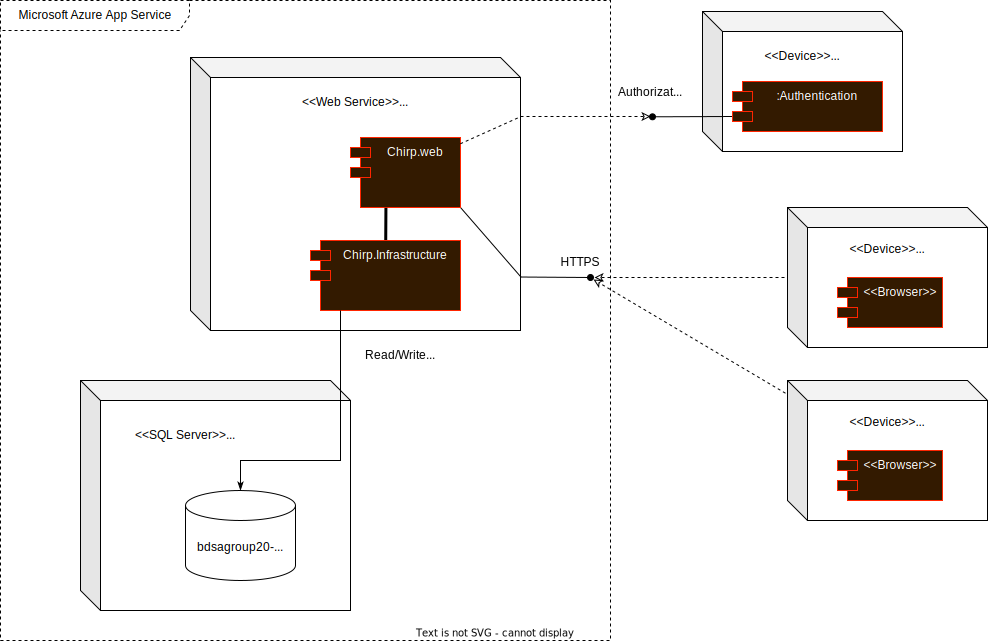
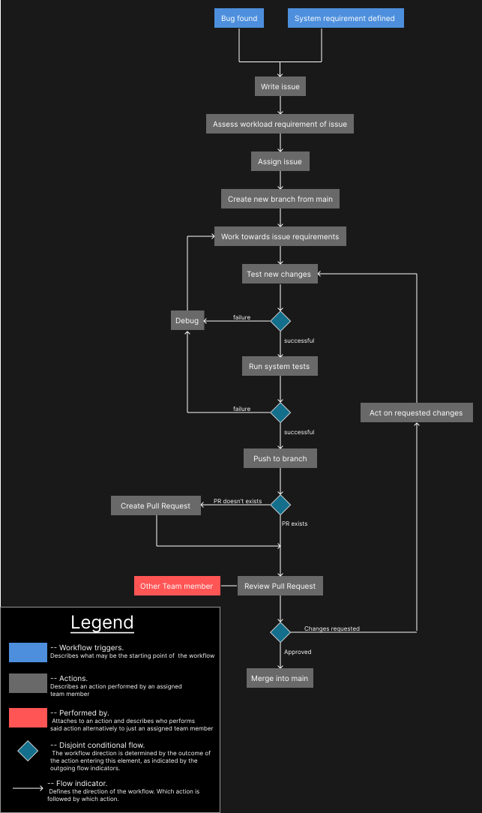

# Design and Architecture of _Chirp!_

## Domain model

> The above image is a UML class diagram depicting the domain model of ***Chirp!***.

## Architecture — In the small

> The above image illustrates the architecture of ***Chirp!***. It's onion based and each onion layer represents a package in the "src" folder of the application.

## Architecture of deployed application

>As we ran out of credits on Azure, we had to switch back to using an in-memory Sqlite database.
> Which is the setup the deployment diagram above illustrates. The first commit hash after reverting back to in-memory Sqlite database is: eb9b72d3ee52408b700a1912c9be30edc007488e.

> This deployment diagram illustrates our former setup, where we used an Azure hosted SQL server.
> The hash of the latest commit using Azure SQL server is: e79d7c8bece998633b05939e62f4fe29495a410a.
> 

Illustrate the architecture of your deployed application. Remember, you developed a client-server application. Illustrate the server component and to where it is deployed, illustrate a client component, and show how these communicate with each other.
> * Under this section, provide two diagrams, one that shows how *Chirp!* was deployed with hosted database and one that shows how it is now again with SQLite.
> * Under this section, provide a brief description of the reason for switching again to SQLite as database.
> * In that description, provide a link to the commit hash in your GitHub repository that points to the latest version of your *Chirp!* application with hosted database (we look at the entire history of your project, so we see that it was there at some point).

## User activities

> Illustrate typical scenarios of a user journey through your *Chirp!* application. That is, start illustrating the first page that is presented to a non-authorized user, illustrate what a non-authorized user can do with your *Chirp!* application, and finally illustrate what a user can do after authentication.
>
> Make sure that the illustrations are in line with the actual behavior of your application.

## Sequence of functionality/calls trough _Chirp!_

> With a UML sequence diagram, illustrate the flow of messages and data through your *Chirp!* application. Start with an HTTP request that is send by an unauthorized user to the root endpoint of your application and end with the completely rendered web-page that is returned to the user.
>
> Make sure that your illustration is complete. That is, likely for many of you there will be different kinds of "calls" and responses. Some HTTP calls and responses, some calls and responses in C# and likely some more. (Note the previous sentence is vague on purpose. I want that you create a complete illustration.)

# Process

## Build, test, release, and deployment

> Illustrate with a UML activity diagram how your *Chirp!* applications are build, tested, released, and deployed. That is, illustrate the flow of activities in your respective GitHub Actions workflows.
>
> Describe the illustration briefly, i.e., how your application is built, tested, released, and deployed.

## Team work

> Show a screenshot of your project board right before hand-in. Briefly describe which tasks are still unresolved, i.e., which features are missing from your applications or which functionality is incomplete.
>
> Briefly describe and illustrate the flow of activities that happen from the new creation of an issue (task description), over development, etc. until a feature is finally merged into the `main` branch of your repository.

The process of implementing changes to the system starts by defining the wanted changes or the problem at hand and writing an issue describing it. The required workload is assessed for the issue. The issue is then assigned to an appropriate amount of team members. The team member(s) then creates a new branch from main and starts working towards the issue acceptance criteria. The new changes are then tested to see if it works as expected. Once it works, run the system tests to ensure no other functionality has been broken in the process. If any test fails, debugging commences and the test phase repeats. If everything works, the changes are pushed to the branch and a pull request is made. Another team member reviews said pull request. If any changes are requested, those will be acted upon and the test phase repeats. When a pull request is approved, the branch will be merged into main.

## How to make _Chirp!_ work locally

> There has to be some documentation on how to come from cloning your project to a running system. That is, Rasmus or Helge have to know precisely what to do in which order. Likely, it is best to describe how we clone your project, which commands we have to execute, and what we are supposed to see then.

## How to run test suite locally

> List all necessary steps that Rasmus or Helge have to perform to execute your test suites. Here, you can assume that we already cloned your repository in the step above.
>
> Briefly describe what kinds of tests you have in your test suites and what they are testing.

The test suite can be located in the `Chirp/Test` folder.

### Contents of test suites

#### Chirp.CoreTests

* Testing that records and classes in fact contain the types and attributes defined in the class and record definitions.
* Testing of constraints on class and record members.
* Testing of correct instantiation of objects as defined in the `Chirp.Core` package.

#### Chirp.InfrastructureTests

#### Chirp.WebTests

#### Test_Utilities

# Ethics

## License

> This application uses the GLP-2 software license.

## LLMs, ChatGPT, CoPilot, and others

> State which LLM(s) were used during development of your project. In case you were not using any, just state so. In case you were using an LLM to support your development, briefly describe when and how it was applied. Reflect in writing to which degree the responses of the LLM were helpful. Discuss briefly if application of LLMs sped up your development or if the contrary was the case.

In our project, we have attempted to strategically leverage LLMs to enhance efficiency where reasonable. The LLMs used in the project are \*Chat-GPT\* and \*Github Co-Pilot\*. They served primarily as sparring partners during debugging processes, where they occasionally have proven helpful in interpretting cryptic error messages or identifying the cause of an unexpected result.

In our experince, the replies recieved from the LLMs have often been inadequate or inaccurate, which is likely due to the LLMs incomplete scope of the project. Despite this, the LLMs have helped the development of the project although it has not been substantially.
